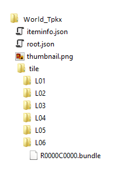

# Tile Package Specification

A tile package is a compressed file with ".tpkx" extension with a simplified structure containing image tiles stored in Compact Cache V2 storage format and tiling scheme and other metadata is stored in a JSON file. This storage format provides better performance to retrieve tiles when accessed over network file shares and cloud storage.
 
These tile package files are supported in ArcGIS Online, ArcGIS Desktop and ArcGIS Enterprise 10.7 or later, ArcGIS Pro 2.3 or later and applications built with ArcGIS Runtime SDK 100.5 or later for Android, Java, iOS, .NET, and Qt

_Note:_ Tile packages with ".tpk" extension, use compact storage V1 format for cache tiles. The spec for this package type is not available and use of tpkx is recommended.

## Folder structure
The folder structure with in the compressed Tile Package (.tpkx) is  illustrated below  in Figure 1. It consists of [iteminfo.json](docs/iteminfo.md), [root.json](docs/root.md), a thumbnail image and a folder named "tile" containing .bundle files, where tiles are stored in [Compact V2 storage format](https://github.com/Esri/raster-tiles-compactcache) for each level of detail. 
  
   

### [iteminfo.json](docs/iteminfo.md)
The ItemInfo.json contains metadata to describe various properties needed to identify and preview the item without loading all the content.

### [root.json](docs/root.md)
It describes various properties needed to visualize the cache content and includes tiling scheme, tile image format, tile size, and layer information objects.

### thumbnail
A thumbnail 24-bit png, typically 200 pixels and 133 pixels.

### tile
The "tile" folder contains the cache tiles in ".bundle" format grouped inside folders representing each level of details of the cache tiling schema. The ".bundle" format uses [Compact Cache V2 storage format](https://github.com/Esri/raster-tiles-compactcache) for storing tiles. 

## Content
This repository contains documentation and a sample tile packages for Map and elevation data.

## Licensing
See [License](LICENSE.TXT)

## Contributing

You are invited to fork this repository to a public or private repository and to send Pull Requests suggest improvements or notify us of errors or omissions in this documentation. Creating a fork solely for this purpose does not constitute the creation and distribution of a derivative work. Please see our [guidelines for  contributing](https://github.com/esri/contributing).
